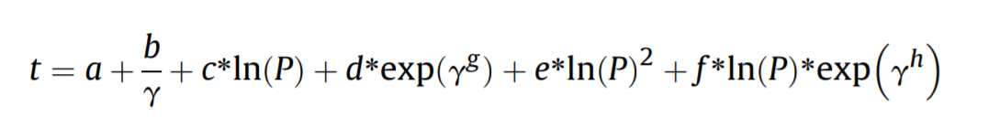
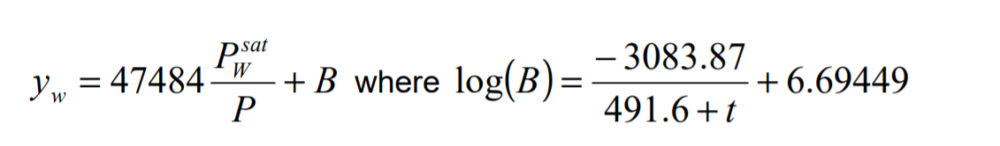
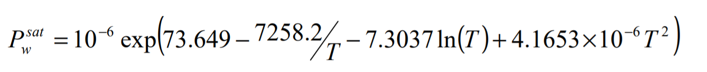
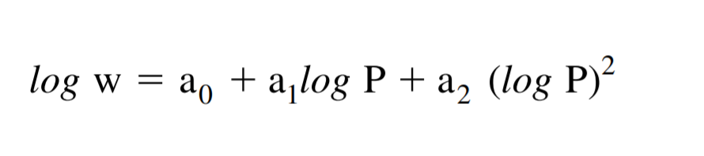
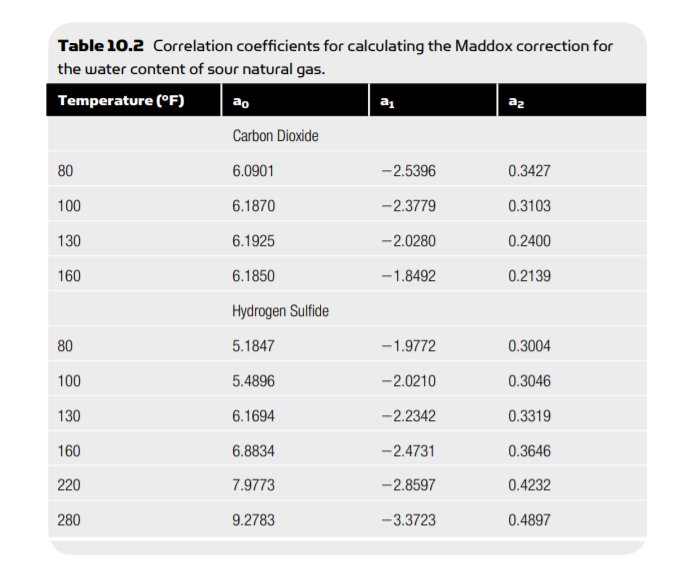
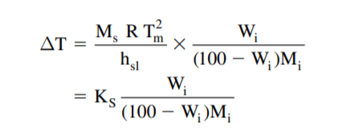

# Inhibition in Natural Gas Pipeline
A software programmed in python to calculate the amount of inhibitor required for depression in freezing point of the Natural Gas to the required extent so that the Hydrate formation doesn't occur inside the pipeline.
The absence of any online or offline tool to predict the hydrate formation temperature and water content in natural gas or hydrate became the cornerstone behind the development of this project.

## Correlations and References
### Correlation used to determine formation temperature from system pressure.
#### 
#### Reference: Mohammad ali Ghayyem, Mojtaba Izadmehr*, Rauf Tavakoli,2014,Developing a simple and accurate correlation for initial estimation of hydrate formation temperature of sweet natural gases using an eclectic approach,Journal of Natural Gas Science and Engineering, 21, 1-4
##### t is in °F and P is in psia

### Bukacek correlation used to determine water content in sweet gas
###### 
###### 
#### P is in between 1 and 960 bar and T is in between 288.15 K and 511.15 K
#### Reference: Alexandre TERRIGEOL , Christophe COQUELET, Antonin CHAPOY,2015,Water content assessment in acid gas,GPA Europe, Annual Conference, 7-8
##### P is in MPa and T is in °C

### Maddox correlation used to determine water content in sour gas
###### 
##### P is in psia and T is in °F
###### 
#### Reference: Natural Gas Hydrates, 2nd Edition 2009 - A Guide for Engineers (Malestrom),237-241

### Hammerschimdt correlation used to determine weight fraction of inhibitor
###### 
##### T is in K, Ks = 1861
#### Reference: Natural Gas Hydrates, 2nd Edition 2009 - A Guide for Engineers (Malestrom),113-115

## Functions defined and used in this project
* formationtemperature(gasgravity, pressure, unit)
  * Returns the hydrate formation temperature for given pressure and calculated gasgravity from composition of the gas.
  * Temperature returned is in °F.
  * New Correlation (mentioned above) has been used to predict the hydrate formation temperature.
* buckekinsweetgas(t,p)
  * Returns the water content in sweet natural gas (natural gas without H2S and CO2).
  * Returns water content in lb/MMSCF.
  * Buckekin's Correlation has been used.
* interpolation(df,t)
  * To interpolate between values in maddox's tables.
* maddox(t,p,co2,h2s,hc,sweetwc)
  * Returns the water content in sour natural gas (natural gas containing H2S and CO2).
  * Returns water content in lb/MMSCF.
  * Maddox's Correlation has been used.
* wtfracofinhibitor(tout,t,molin)
  * Returns the weight fraction of the inhibitor required inside the pipeline.
  * Hammerschimdt Correlation has been used.

## Inputs
* Composition of the gas
* System Pressure
* Inlet Temperature of Pipeline
* Outlet Temperature of Pipeline 
* Gas flow rate in MMSCFD
* Inhibitor

 
